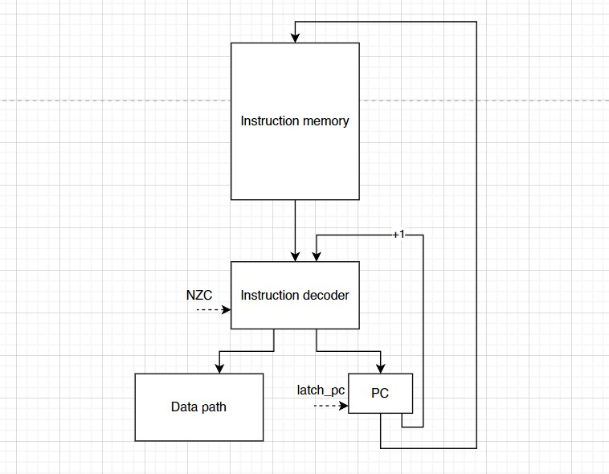

# csa-lab-3. Транслятор и модель

- P33151, Понамарев Степан Андреевич
- `alg -> asm | cisc -> risc | harv | hw | instr | struct | stream | mem | cstr | prob2 | [4]char`
- Без усложнения.
- С упрощением


## Язык программирования

### Синтаксис

**Форма бэкуса-Наура:**

``` ebnf
<программа> ::= [<секкция данных>] <секция кода>

<секция данных> ::= data: <строка константы>
<строка константы> ::= <адрес> | [<метка>] .word <константы> | 
[<метка>] .word <константы> <строка константы>
<константы> ::= <константа> | <константа>, <константы>
<константа> ::= <число> | "<слово>"

<секция кода> ::= start: <программа>
<программа> ::= <строка_программы> | <строка_программы> <программа>
<строка_программы> ::= <адрес> | <метка> | [<метка>] <адресная команда> <операнд> | 
[<метка>] <адресная команда> <операнд>, <операнд> | 
[<метка>] <безадресная команда>

<метка> ::= <слово>: 
<адрес> = org <число>
<адресная команда> = ... (см. систему команд)
<безадресная команда> ::= ... (см. систему команд)
<операнд> ::= <число> | (<число>) | <метка> | (<метка>)

<слово> ::= <символ> | <слово> <символ>
<число> ::= <цифра> | <число> <цифра>
<цифра> ::= 0| 1 | 2 | .. | 8 | 9
<символ> ::= a | b | c | ... | z | A | B | C | ... | Z | _ | <цифра>

```

**Пояснение:**

Каждая непустая строка программы это одно из нижеперечисленных:

* **метка**
  * указывается название метки и двоеточие
* **константа**
  * указывается `.word` и значение в виде числа или строки 
  * может иметь метку в начале
  * можно перечислять через запятую, значения будут записаны в ячейки друг за другом
  * константа может быть 32-битным знаковым числом
  * константа может быть строкой: указывается строка в кавычках и нуль-терминатор через запятую
* **безадресная команда**
  * указывается только название команды
* **адресная команда**
  * указывается название команды и операнд через пробел
  * некоторые команды работают с двумя операндами 
  * операнды разделяются запятой
* **адрес**
  * указывается специальное слово `org` и адрес в десятичном формате
  * не является командой, а лишь указывает положение кода в памяти
* **комментарий**
  * пишется `;` и текст
  * комментарии не читаются программой и удаляются после компиляции

Пример программы, вычисляющей С = A + B

```asm
org 0
data:
	A: .word 20
	B: .word 24
	C: .word 0
org 0
start:
	mov eax, (A)
	add eax, (B)
	mov (C), eax
	hlt
```

**Семантика:**

- Видимость данных -- глобальная
- Поддерживаются целочисленные литералы, находящиеся в диапазоне от $`-2^{31}`$ до $`2^{31}-1`$
- Поддерживаются строковые литералы, символы стоки необходимо заключить в кавычки, после строки через запятую необходимо указать `0`
- Код выполняется последовательно
- Программа обязательно должна включать метку `start:`, указывающую на 1-ю выполняемую инструкцию. Эта метка не может указывать на константу
- Программа обязательно должна включать метку `data:`, если в программе есть константы
- Название метки не должно совпадать с названием команды и не может содержать цифры
- Пустые строки игнорируются, количество пробелов в начале и конце строки не важно
- Любой текст, расположенный после символа `';'` трактуется как комментарий и до конца строки
- Память выделяется статически, при запуске модели.


## Организация памяти

```text
       Registers
+------------------------------+
| eax, ebx, ecx, edx           |
| esi, edi, ebp, esp           |
+------------------------------+

       Instruction memory
+------------------------------+
| 00  : program start          |
| 01  : <command 1>            |
| 02  : <command 2>            |
|    ...                       |
| n   : halt                   |
|    ...                       |
| i   : nop                    |
|    ...                       |
+------------------------------+

          Data memory
+------------------------------+
| 0000: <constant 1>           |
| 0001: <constant 2>           |
|    ...                       |
| l+0 : <str symbol 1>         |
| l+1 : <str symbol 2>         |
|    ...                       |
| 2045: <stack base>           |
| 2046: <in>                   |
| 2047: <out>                  |
+------------------------------+
```

- Память команд и данныx -- раздельная
- Размер машинного слова памяти команд -- `32` бит.
- Размер машинного слова памяти данных -- `32` бит. Числа знаковые. Линейное адресное пространство. Реализуется списком чисел.
- Память данных содержит `2048` ячеек
- Адрес `2045` является указателем стека при старте процессора. Стек растет вверх.
- Ячейка с адресом `2046` маппится на устройство ввода
- Ячейка с адресом `2047` маппится на устройство вывода
- Поддерживаются только прямая адресация и непосредственная загрузка.
- Данные и инструкции хранятся в том же порядке, в котором они были написаны программистом.
- Память выделяется статически, при запуске модели.
- Для хранения динамических данных программист может воспользоваться выделением памяти на стеке (команды `push` и `pop`).
- Если при написании команды указан регистр или число, будет использована прямая загрузка.
- При написании регистра или числа в скобках, будет использована непосредственная адресация в память данных.


Программисту доступны следующие регистры:
- `eax` -- аккумуляторный регистр (accumulator register)
- `ebx` -- базовый регистр (base register)
- `ecx` -- счетный регистр (count register)
- `edx` -- регистр данных (data register)
- `esi` -- указатель источника (source index register)
- `edi` -- указатель приемника (destination index register)
- `ebp` -- указатель базы стека (base pointer register)
- `esp` -- указатель стека (stack pointer register)

Также в модели существуют следующие регистры, недоступные для прямого взаимодействия:
- `pc` -- счётчик команд (program counter)
- `data_addr` -- регистр адреса (address register)

Разрядность всех регистров -- `32` бит.


## Система команд

Особенности процессора:

- Машинное слово -- 32 бит
- Доступ к памяти данных осуществляется по адресу
- Ввод и вывод осуществляется посредством доступа к ячейкам памяти данных:
  - чтение из ячейки `2046` -- ввод
  - запись в ячейку `2047` -- вывод

### Набор инструкций


| №  | Язык   | Кол-во операндов | Кол-во тактов | Описание                                                                      | Сохранение результата<br/>в первый операнд |
|:---|:-------|:-----------------|:--------------|:------------------------------------------------------------------------------|:-------------------------------------------|
| 1  | `nop`  | 0                | 1             | отсутствие операции                                                           | -                                          |
| 2  | `inc`  | 1                | 1             | увеличить значение в ячейке на 1                                              | +                                          |
| 3  | `dec`  | 1                | 1             | уменьшить значение в ячейке на 1                                              | +                                          |
| 4  | `mov`  | 2                | 1             | записать в первый операнд значение из второго                                 | +                                          |
| 5  | `add`  | 2                | 1             | сложить операнды                                                              | +                                          |
| 6  | `sub`  | 2                | 1             | вычесть из первого операнда второй                                            | +                                          |
| 7  | `xor`  | 2                | 1             | найти побитовый xor первого операнда со вторым                                | +                                          |
| 8  | `cmp`  | 2                | 1             | выставить флаги `N` и `Z` как результат вычитания второго операнда из первого | -                                          |
| 9  | `jmp`  | 1                | 1             | безусловный переход по адресу                                                 | -                                          |
| 10 | `jz`   | 1                | 1             | перейти в заданную ячейку если `Z = 1`                                        | -                                          |
| 11 | `jnz`  | 1                | 1             | перейти в заданную ячейку если `Z = 0`                                        | -                                          |
| 12 | `jlt`  | 1                | 1             | перейти в заданную ячейку если `N = 1`                                        | -                                          |
| 13 | `jge`  | 1                | 1             | перейти в заданную ячейку если `N = 0`                                        | -                                          |
| 14 | `jmc`  | 1                | 1             | перейти в заданную ячейку если `C = 1`                                        | -                                          |
| 15 | `jmnc` | 1                | 1             | перейти в заданную ячейку если `C = 0`                                        | -                                          |
| 16 | `push` | 1                | 2             | положить значение в стек                                                      | -                                          |
| 17 | `pop`  | 1                | 2             | достать значение с вершины стека                                              | +                                          |
| 18 | `in`   | 0                | 1             | положить значение из ячейки `2046` в аккумулятор                              | +                                          |
| 19 | `out`  | 0                | 1             | положить значение из аккумулятора в ячейку `2047`                             | +                                          |
| 20 | `mod`  | 2                | 2             | вычислить остаток от деления первого операнда на второй                       | +                                          |
| 21 | `div`  | 2                | 2             | вычислить целую часть от деления первого операнда на второй                   | +                                          |
| 22 | `hlt`  | 0                | 0             | остановка                                                                     | -                                          |


### Кодирование инструкций

- Машинный код сериализуется в JSON с двумя списками `data_memory` и `instruction_memory`.
- Один элемент data_memory -- одна числовая константа или один код символа строковой константы.
- Строковые константы могут занимать несколько ячеек
- Один элемент instruction_memory -- одна инструкция.

Например, исходный код:
```assembly
  org 0
  data:
      H: .word "Hello!", 0
  start:
      mov eax, H
      hlt
```

Машинный код:
```json
{
  "data_memory": [
    {"index": 0, "value": 72},
    {"index": 1, "value": 101},
    {"index": 2, "value": 108},
    {"index": 3, "value": 108},
    {"index": 4, "value": 111},
    {"index": 5, "value": 33},
    {"index": 6, "value": 0}
  ],
  "instruction_memory": [
    {"index": 7, "opcode": "mov", "operand1": "eax", "operand2": "0"},
    {"index": 8, "opcode": "hlt"}
  ]
}
```

где:

- `index` - адрес инструкции или данных;
- `opcode` -- строка с кодом операции;
- `operand1` -- аргумент №1;
- `operand2` -- аргумент №2;
- `value` -- значение в ячейке памяти.

Типы данных в модуле [isa](./isa.py):
- Opcode - перечисление кодов операций
- Command - класс инструкции для упрощения перевода в словарь
- Operand - вспомогательный класс для Command, определяющий операнд

## Транслятор

Интерфейс командной строки: `translator.py <input_file> <target_file>`

Реализовано в модуле: [translator](./translator.py)

Этапы трансляции (функция `translate`):

1. чтение исходного кода
2. удаление пустых строк и комментариев
3. извлечение значимых частей: метки, адреса, команды и т.д.
4. валидация операндов
5. замена меток на адреса в памяти
6. генерация слов машинного кода из инструкций
7. запись полученных слов в файл


## Модель процессора

Интерфейс командной строки: `machine.py <machine_code_file> <input_file>`

Реализовано в модуле: [machine](./machine.py).

### DataPath


Реализован в классе `DataPath`.

`data_memory` -- однопортовая память, поэтому либо читаем, либо пишем.

Сигналы (обрабатываются за один такт, реализованы в виде методов класса):

- `latch_data_addr` -- защёлкнуть выбранное значение в `data_addr`;
- `data_latch_reg` -- защёлкнуть в выбранный регистр выход памяти данных;
- `wr_in_data` -- :
  - записать выбранное значение в память;
  - с порта ввода `input` (обработка на Python):
        - извлечь из входного буфера значение и записать в память;
        - если буфер пуст -- выбросить исключение;
- `wr_in_reg` -- записать выбранное значение в выбранный регистр;
- `output` -- передать значение в устройство вывода;

Флаги:

- `negative` -- отражает наличие отрицательного значения в аккумуляторе.
- `zero` -- отражает наличие нулевого значения в аккумуляторе.
- `carry` -- отражает наличие переноса из последнего бита.

### ControlUnit



Реализован в классе `ControlUnit`.

- Hardwired (реализовано полностью на Python).
- Метод `decode_and_execute_instruction` моделирует выполнение полного цикла инструкции (1-2 такта процессора).

Сигнал:

- `latch_program_counter` -- сигнал для обновления счётчика команд в ControlUnit.

Особенности работы модели:

- Цикл симуляции осуществляется в функции `simulation`.
- Шаг моделирования соответствует одной инструкции с выводом состояния в журнал.
- Для журнала состояний процессора используется стандартный модуль `logging`.
- Количество инструкций для моделирования лимитировано.
- Остановка моделирования осуществляется при:
    - превышении лимита количества выполняемых инструкций;
    - исключении `EOFError` -- если нет данных для чтения из порта ввода;
    - исключении `StopIteration` -- если выполнена инструкция `halt`.

## Тестирование


Реализованные программы

1. [hello world](examples/hello_world.asm): вывести на экран строку `'Hello World!'`
2. [cat](examples/cat.asm): программа `cat`, повторяем ввод на выводе.
3. [hello_user](examples/hello_user.asm) -- программа `hello_user`: запросить у пользователя его
   имя, считать его, вывести на экран приветствие
4. [prob2](examples/prob2.asm): найти сумму всех четных чисел Фибоначчи, не превышающих `4 000 000`.


Интеграционные тесты реализованы тут [integration_test](./integration_test.py):

- через golden tests, конфигурация которых лежит в папке [golden](./golden).

CI:

``` yaml
name: Python CI

on: [push]

jobs:
  test:
    runs-on: ubuntu-latest

    steps:
      - name: Checkout code
        uses: actions/checkout@v4

      - name: Set up Python
        uses: actions/setup-python@v4
        with:
          python-version: 3.11

      - name: Install dependencies
        run: |
          python -m pip install --upgrade pip
          pip install poetry
          poetry install

      - name: Run tests and collect coverage
        run: |
          poetry run coverage run -m pytest .
          poetry run coverage report -m
        env:
          CI: true

  lint:
    runs-on: ubuntu-latest

    steps:
      - name: Checkout code
        uses: actions/checkout@v4

      - name: Set up Python
        uses: actions/setup-python@v4
        with:
          python-version: 3.11

      - name: Install dependencies
        run: |
          python -m pip install --upgrade pip
          pip install poetry
          poetry install

      - name: Check code formatting with Ruff
        run: poetry run ruff format --check .

      - name: Run Ruff linters
        run: poetry run ruff check .
```


Пример использования и журнал работы процессора на примере `cat`:

``` shell
$ cat .\examples\input.txt
Stepan
$ cat .\examples\cat.asm
org 0
start:
loop:
        ; считывание и вывод входных данных
        in ; загружаем ввод (2046) в eax
        cmp eax, 0 ; проверяем, что не достигли конца строки
        jz end_loop ; иначе заканчиваем цикл
        out ; сохраняем символ из eax в устройстве вывода (2047)
        jmp loop ; продолжаем цикл
end_loop:
        hlt
$ python .\translator.py .\examples\cat.asm target.out
source LoC: 11 code instr: 2
$ cat .\target.out
{
        "data_memory": [

        ],
        "instruction_memory": [
                {"index": 0, "opcode": "mov", "operand1": "eax", "operand2": "(2046)"},
                {"index": 1, "opcode": "cmp", "operand1": "eax", "operand2": "0"},
                {"index": 2, "opcode": "jz", "operand1": 5},
                {"index": 3, "opcode": "mov", "operand1": "(2047)", "operand2": "eax"},
                {"index": 4, "opcode": "jmp", "operand1": 0},
                {"index": 5, "opcode": "hlt"}
        ]
}
$ python .\machine.py .\target.out .\examples\input.txt
DEBUG:root:TICK:   0 PC:   0 ADDR:   0 MEM_OUT: 0 EAX(0), EBX(None), ECX(None), EDX(None), ESI(None), EDI(None), EBP(None), ESP(2045)        mov eax (2046)
DEBUG:root:TICK:   2 PC:   1 ADDR: 2046 MEM_OUT: 0 EAX(83), EBX(None), ECX(None), EDX(None), ESI(None), EDI(None), EBP(None), ESP(2045)      cmp eax 0
DEBUG:root:TICK:   3 PC:   2 ADDR: 2046 MEM_OUT: 0 EAX(83), EBX(None), ECX(None), EDX(None), ESI(None), EDI(None), EBP(None), ESP(2045)      jz 5
DEBUG:root:TICK:   4 PC:   3 ADDR: 2046 MEM_OUT: 0 EAX(83), EBX(None), ECX(None), EDX(None), ESI(None), EDI(None), EBP(None), ESP(2045)      mov (2047) eax
DEBUG:root:output: '' << 'S'
DEBUG:root:TICK:   6 PC:   4 ADDR: 2047 MEM_OUT: 83 EAX(83), EBX(None), ECX(None), EDX(None), ESI(None), EDI(None), EBP(None), ESP(2045)     jmp 0
DEBUG:root:TICK:   7 PC:   0 ADDR: 2047 MEM_OUT: 83 EAX(83), EBX(None), ECX(None), EDX(None), ESI(None), EDI(None), EBP(None), ESP(2045)     mov eax (2046)
DEBUG:root:TICK:   9 PC:   1 ADDR: 2046 MEM_OUT: 0 EAX(116), EBX(None), ECX(None), EDX(None), ESI(None), EDI(None), EBP(None), ESP(2045)     cmp eax 0
DEBUG:root:TICK:  10 PC:   2 ADDR: 2046 MEM_OUT: 0 EAX(116), EBX(None), ECX(None), EDX(None), ESI(None), EDI(None), EBP(None), ESP(2045)     jz 5
DEBUG:root:TICK:  11 PC:   3 ADDR: 2046 MEM_OUT: 0 EAX(116), EBX(None), ECX(None), EDX(None), ESI(None), EDI(None), EBP(None), ESP(2045)     mov (2047) eax
DEBUG:root:output: 'S' << 't'
DEBUG:root:TICK:  13 PC:   4 ADDR: 2047 MEM_OUT: 116 EAX(116), EBX(None), ECX(None), EDX(None), ESI(None), EDI(None), EBP(None), ESP(2045)   jmp 0
DEBUG:root:TICK:  14 PC:   0 ADDR: 2047 MEM_OUT: 116 EAX(116), EBX(None), ECX(None), EDX(None), ESI(None), EDI(None), EBP(None), ESP(2045)   mov eax (2046)
DEBUG:root:TICK:  16 PC:   1 ADDR: 2046 MEM_OUT: 0 EAX(101), EBX(None), ECX(None), EDX(None), ESI(None), EDI(None), EBP(None), ESP(2045)     cmp eax 0
DEBUG:root:TICK:  17 PC:   2 ADDR: 2046 MEM_OUT: 0 EAX(101), EBX(None), ECX(None), EDX(None), ESI(None), EDI(None), EBP(None), ESP(2045)     jz 5
DEBUG:root:TICK:  18 PC:   3 ADDR: 2046 MEM_OUT: 0 EAX(101), EBX(None), ECX(None), EDX(None), ESI(None), EDI(None), EBP(None), ESP(2045)     mov (2047) eax
DEBUG:root:output: 'St' << 'e'
DEBUG:root:TICK:  20 PC:   4 ADDR: 2047 MEM_OUT: 101 EAX(101), EBX(None), ECX(None), EDX(None), ESI(None), EDI(None), EBP(None), ESP(2045)   jmp 0
DEBUG:root:TICK:  21 PC:   0 ADDR: 2047 MEM_OUT: 101 EAX(101), EBX(None), ECX(None), EDX(None), ESI(None), EDI(None), EBP(None), ESP(2045)   mov eax (2046)
DEBUG:root:TICK:  23 PC:   1 ADDR: 2046 MEM_OUT: 0 EAX(112), EBX(None), ECX(None), EDX(None), ESI(None), EDI(None), EBP(None), ESP(2045)     cmp eax 0
DEBUG:root:TICK:  24 PC:   2 ADDR: 2046 MEM_OUT: 0 EAX(112), EBX(None), ECX(None), EDX(None), ESI(None), EDI(None), EBP(None), ESP(2045)     jz 5
DEBUG:root:TICK:  25 PC:   3 ADDR: 2046 MEM_OUT: 0 EAX(112), EBX(None), ECX(None), EDX(None), ESI(None), EDI(None), EBP(None), ESP(2045)     mov (2047) eax
DEBUG:root:output: 'Ste' << 'p'
DEBUG:root:TICK:  27 PC:   4 ADDR: 2047 MEM_OUT: 112 EAX(112), EBX(None), ECX(None), EDX(None), ESI(None), EDI(None), EBP(None), ESP(2045)   jmp 0
DEBUG:root:TICK:  28 PC:   0 ADDR: 2047 MEM_OUT: 112 EAX(112), EBX(None), ECX(None), EDX(None), ESI(None), EDI(None), EBP(None), ESP(2045)   mov eax (2046)
DEBUG:root:TICK:  30 PC:   1 ADDR: 2046 MEM_OUT: 0 EAX(97), EBX(None), ECX(None), EDX(None), ESI(None), EDI(None), EBP(None), ESP(2045)      cmp eax 0
DEBUG:root:TICK:  31 PC:   2 ADDR: 2046 MEM_OUT: 0 EAX(97), EBX(None), ECX(None), EDX(None), ESI(None), EDI(None), EBP(None), ESP(2045)      jz 5
DEBUG:root:TICK:  32 PC:   3 ADDR: 2046 MEM_OUT: 0 EAX(97), EBX(None), ECX(None), EDX(None), ESI(None), EDI(None), EBP(None), ESP(2045)      mov (2047) eax
DEBUG:root:output: 'Step' << 'a'
DEBUG:root:TICK:  34 PC:   4 ADDR: 2047 MEM_OUT: 97 EAX(97), EBX(None), ECX(None), EDX(None), ESI(None), EDI(None), EBP(None), ESP(2045)     jmp 0
DEBUG:root:TICK:  35 PC:   0 ADDR: 2047 MEM_OUT: 97 EAX(97), EBX(None), ECX(None), EDX(None), ESI(None), EDI(None), EBP(None), ESP(2045)     mov eax (2046)
DEBUG:root:TICK:  37 PC:   1 ADDR: 2046 MEM_OUT: 0 EAX(110), EBX(None), ECX(None), EDX(None), ESI(None), EDI(None), EBP(None), ESP(2045)     cmp eax 0
DEBUG:root:TICK:  38 PC:   2 ADDR: 2046 MEM_OUT: 0 EAX(110), EBX(None), ECX(None), EDX(None), ESI(None), EDI(None), EBP(None), ESP(2045)     jz 5
DEBUG:root:TICK:  39 PC:   3 ADDR: 2046 MEM_OUT: 0 EAX(110), EBX(None), ECX(None), EDX(None), ESI(None), EDI(None), EBP(None), ESP(2045)     mov (2047) eax
DEBUG:root:output: 'Stepa' << 'n'
DEBUG:root:TICK:  41 PC:   4 ADDR: 2047 MEM_OUT: 110 EAX(110), EBX(None), ECX(None), EDX(None), ESI(None), EDI(None), EBP(None), ESP(2045)   jmp 0
DEBUG:root:TICK:  42 PC:   0 ADDR: 2047 MEM_OUT: 110 EAX(110), EBX(None), ECX(None), EDX(None), ESI(None), EDI(None), EBP(None), ESP(2045)   mov eax (2046)
DEBUG:root:TICK:  44 PC:   1 ADDR: 2046 MEM_OUT: 0 EAX(10), EBX(None), ECX(None), EDX(None), ESI(None), EDI(None), EBP(None), ESP(2045)      cmp eax 0
DEBUG:root:TICK:  45 PC:   2 ADDR: 2046 MEM_OUT: 0 EAX(10), EBX(None), ECX(None), EDX(None), ESI(None), EDI(None), EBP(None), ESP(2045)      jz 5
DEBUG:root:TICK:  46 PC:   3 ADDR: 2046 MEM_OUT: 0 EAX(10), EBX(None), ECX(None), EDX(None), ESI(None), EDI(None), EBP(None), ESP(2045)      mov (2047) eax
DEBUG:root:output: 'Stepan' << '\n'
DEBUG:root:TICK:  48 PC:   4 ADDR: 2047 MEM_OUT: 10 EAX(10), EBX(None), ECX(None), EDX(None), ESI(None), EDI(None), EBP(None), ESP(2045)     jmp 0
DEBUG:root:TICK:  49 PC:   0 ADDR: 2047 MEM_OUT: 10 EAX(10), EBX(None), ECX(None), EDX(None), ESI(None), EDI(None), EBP(None), ESP(2045)     mov eax (2046)
WARNING:root:Input buffer is empty!
INFO:root:output_buffer: 'Stepan\n'
Stepan

instr_counter:  35 ticks: 49

```

Пример проверки исходного кода:

``` shell
$ poetry run pytest . -v
c:\users\тёпа\onedrive - itmo university\itmo\архитектура компьютера\3 лаба\src\.venv\lib\site-packages\pytest_golden\plugin.py:53: GoldenTestUsageWarning: Add 'ena
ble_assertion_pass_hook=true' to pytest.ini for safer usage of pytest-golden.
  warnings.warn(
======================================================================= test session starts =======================================================================
platform win32 -- Python 3.8.5, pytest-8.0.2, pluggy-1.4.0 -- c:\users\тёпа\onedrive - itmo university\itmo\архитектура компьютера\3 лаба\src\.venv\scripts\python.e
xe
cachedir: .pytest_cache
rootdir: C:\Users\Тёпа\OneDrive - ITMO UNIVERSITY\ITMO\Архитектура компьютера\3 лаба\csa-lab-3
integration_test.py::test_translator_and_machine[golden/hellouser.yml] PASSED                                                                                [ 50%] 
integration_test.py::test_translator_and_machine[golden/helloworld.yml] PASSED                                                                               [ 75%] 
integration_test.py::test_translator_and_machine[golden/prob2.yml] PASSED                                                                                    [100%] 

======================================================================== 4 passed in 0.33s ======================================================================== 
(.venv) (base) PS C:\Users\Тёпа\OneDrive - ITMO UNIVERSITY\ITMO\Архитектура компьютера\3 лаба\csa-lab-3> 
(.venv) (base) PS C:\Users\Тёпа\OneDrive - ITMO UNIVERSITY\ITMO\Архитектура компьютера\3 лаба\csa-lab-3>
(.venv) (base) PS C:\Users\Тёпа\OneDrive - ITMO UNIVERSITY\ITMO\Архитектура компьютера\3 лаба\csa-lab-3>
(.venv) (base) PS C:\Users\Тёпа\OneDrive - ITMO UNIVERSITY\ITMO\Архитектура компьютера\3 лаба\csa-lab-3> poetry run pytest . -v --update-goldens
c:\users\тёпа\onedrive - itmo university\itmo\архитектура компьютера\3 лаба\src\.venv\lib\site-packages\pytest_golden\plugin.py:53: GoldenTestUsageWarning: Add 'ena
ble_assertion_pass_hook=true' to pytest.ini for safer usage of pytest-golden.
  warnings.warn(
======================================================================= test session starts =======================================================================
platform win32 -- Python 3.8.5, pytest-8.0.2, pluggy-1.4.0 -- c:\users\тёпа\onedrive - itmo university\itmo\архитектура компьютера\3 лаба\src\.venv\scripts\python.e
xe
cachedir: .pytest_cache
rootdir: C:\Users\Тёпа\OneDrive - ITMO UNIVERSITY\ITMO\Архитектура компьютера\3 лаба\csa-lab-3
plugins: golden-0.2.2
collected 4 items

integration_test.py::test_translator_and_machine[golden/cat.yml] PASSED                                                                                      [ 25%]
integration_test.py::test_translator_and_machine[golden/hellouser.yml] PASSED                                                                                [ 50%]
integration_test.py::test_translator_and_machine[golden/helloworld.yml] PASSED                                                                               [ 75%]
integration_test.py::test_translator_and_machine[golden/prob2.yml] PASSED                                                                                    [100%]

======================================================================== 4 passed in 0.98s ======================================================================== 

```

```text
| ФИО                        | алг   | LoC | code байт | code инстр. | инстр. | такт. | вариант |
| Понамарев Степан Андреевич | hello | 15  | -         | 8           | 81     | 122   | `asm | risc | harv | hw | instr | struct | stream | mem | cstr | prob2 | [4]char`     |
| Понамарев Степан Андреевич | cat   | 11  | -         | 6           | 30     | 42    | `asm | risc | harv | hw | instr | struct | stream | mem | cstr | prob2 | [4]char`  |
| Понамарев Степан Андреевич | prob2 | 40  | -         | 43          | 465    | 698   | `asm | risc | harv | hw | instr | struct | stream | mem | cstr | prob2 | [4]char`     |
```
