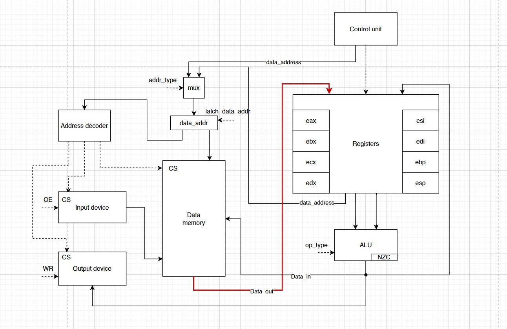

# csa-lab-3. Транслятор и модель

- P33151, Понамарев Степан Андреевич
- `alg -> asm | cisc -> risc | harv | hw | instr | struct | stream | mem | cstr | prob2 | [4]char`
- Без усложнения.
- С упрощением


## Язык программирования

### Синтаксис

**Форма бэкуса-Наура:**

``` ebnf
<программа> ::= [<секкция данных>] <секция кода>

<секция данных> ::= data: <строка константы>
<строка константы> ::= <адрес> | [<метка>] .word <константы> | 
[<метка>] .word <константы> <строка константы>
<константы> ::= <константа> | <константа>, <константы>
<константа> ::= <число> | "<слово>"

<секция кода> ::= start: <программа>
<программа> ::= <строка_программы> | <строка_программы> <программа>
<строка_программы> ::= <адрес> | <метка> | [<метка>] <адресная команда> <операнд> | 
[<метка>] <адресная команда> <операнд>, <операнд> | 
[<метка>] <безадресная команда>

<метка> ::= <слово>: 
<адрес> = org <число>
<адресная команда> = ... (см. систему команд)
<безадресная команда> ::= ... (см. систему команд)
<операнд> ::= <число> | (<число>) | <метка> | (<метка>)

<слово> ::= <символ> | <слово> <символ>
<число> ::= <цифра> | <число> <цифра>
<цифра> ::= 0| 1 | 2 | .. | 8 | 9
<символ> ::= a | b | c | ... | z | A | B | C | ... | Z | _ | <цифра>

```

**Пояснение:**

Каждая непустая строка программы это одно из нижеперечисленных:

* **метка**
  * указывается название метки и двоеточие
* **константа**
  * указывается `.word` и значение в виде числа или строки 
  * может иметь метку в начале
  * можно перечислять через запятую, значения будут записаны в ячейки друг за другом
  * константа может быть 32-битным знаковым числом
  * константа может быть строкой: указывается строка в кавычках и нуль-терминатор через запятую
* **безадресная команда**
  * указывается только название команды
* **адресная команда**
  * указывается название команды и операнд через пробел
  * некоторые команды работают с двумя операндами 
  * операнды разделяются запятой
* **адрес**
  * указывается специальное слово `org` и адрес в десятичном формате
  * не является командой, а лишь указывает положение кода в памяти
* **комментарий**
  * пишется `;` и текст
  * комментарии не читаются программой и удаляются после компиляции

**Семантика:**

- Видимость данных -- глобальная
- Поддерживаются целочисленные литералы, находящиеся в диапазоне от $`-2^{31}`$ до $`2^{31}-1`$
- Поддерживаются строковые литералы, символы стоки необходимо заключить в кавычки, после строки через запятую необходимо указать `0`
- Код выполняется последовательно
- Программа обязательно должна включать метку `start:`, указывающую на 1-ю выполняемую инструкцию. Эта метка не может указывать на константу
- Программа обязательно должна включать метку `data:`, если в программе есть константы
- Название метки не должно совпадать с названием команды и не может содержать цифры
- Пустые строки игнорируются, количество пробелов в начале и конце строки не важно
- Любой текст, расположенный после символа `';'` трактуется как комментарий и до конца строки
- Память выделяется статически, при запуске модели.


## Организация памяти

```text
       Registers
+------------------------------+
| eax, ebx, ecx, edx           |
| esi, edi, ebp, esp           |
+------------------------------+

       Instruction memory
+------------------------------+
| 00  : program start          |
| 01  : <command 1>            |
| 02  : <command 2>            |
|    ...                       |
| n   : halt                   |
|    ...                       |
| i   : nop                    |
|    ...                       |
+------------------------------+

          Data memory
+------------------------------+
| 0000: <constant 1>           |
| 0001: <constant 2>           |
|    ...                       |
| l+0 : <str symbol 1>         |
| l+1 : <str symbol 2>         |
|    ...                       |
| 2045: <stack base>           |
| 2046: <in>                   |
| 2047: <out>                  |
+------------------------------+
```

- Память команд и данныx -- раздельная
- Размер машинного слова памяти команд -- `32` бит.
- Размер машинного слова памяти данных -- `32` бит. Числа знаковые. Линейное адресное пространство. Реализуется списком чисел.
- Память данных содержит `2048` ячеек
- Адрес `2045` является указателем стека при старте процессора. Стек растет вверх.
- Ячейка с адресом `2046` маппится на устройство ввода
- Ячейка с адресом `2047` маппится на устройство вывода
- Поддерживаются только прямая адресация и непосредственная загрузка.
- Данные и инструкции хранятся в том же порядке, в котором они были написаны программистом.
- Память выделяется статически, при запуске модели.
- Для хранения динамических данных программист может воспользоваться выделением памяти на стеке (команды `push` и `pop`).
- Если при написании команды указан регистр или число, будет использована прямая загрузка.
- При написании регистра или числа в скобках, будет использована непосредственная адресация в память данных.


Программисту доступны следующие регистры:
- `eax` -- аккумуляторный регистр (accumulator register)
- `ebx` -- базовый регистр (base register)
- `ecx` -- счетный регистр (count register)
- `edx` -- регистр данных (data register)
- `esi` -- указатель источника (source index register)
- `edi` -- указатель приемника (destination index register)
- `ebp` -- указатель базы стека (base pointer register)
- `esp` -- указатель стека (stack pointer register)

Также в модели существуют следующие регистры, недоступные для прямого взаимодействия:
- `pc` -- счётчик команд (program counter)
- `data_addr` -- регистр адреса (address register)

Разрядность всех регистров -- `32` бит.


## Система команд

Особенности процессора:

- Машинное слово -- 32 бит
- Доступ к памяти данных осуществляется по адресу
- Ввод и вывод осуществляется посредством доступа к ячейкам памяти данных:
  - чтение из ячейки `2046` -- ввод
  - запись в ячейку `2047` -- вывод

### Набор инструкций


| №  | Язык   | Кол-во операндов | Кол-во тактов | Описание                                                                      | Сохранение результата<br/>в первый операнд |
|:---|:-------|:-----------------|:--------------|:------------------------------------------------------------------------------|:-------------------------------------------|
| 1  | `nop`  | 0                | 1             | отсутствие операции                                                           | -                                          |
| 2  | `inc`  | 1                | 1             | увеличить значение в ячейке на 1                                              | +                                          |
| 3  | `dec`  | 1                | 1             | уменьшить значение в ячейке на 1                                              | +                                          |
| 4  | `mov`  | 2                | 1             | записать в первый операнд значение из второго                                 | +                                          |
| 5  | `add`  | 2                | 1             | сложить операнды                                                              | +                                          |
| 6  | `sub`  | 2                | 1             | вычесть из первого операнда второй                                            | +                                          |
| 7  | `xor`  | 2                | 1             | найти побитовый xor первого операнда со вторым                                | +                                          |
| 8  | `cmp`  | 2                | 1             | выставить флаги `N` и `Z` как результат вычитания второго операнда из первого | -                                          |
| 9  | `jmp`  | 1                | 1             | безусловный переход по адресу                                                 | -                                          |
| 10 | `jz`   | 1                | 1             | перейти в заданную ячейку если `Z = 1`                                        | -                                          |
| 11 | `jnz`  | 1                | 1             | перейти в заданную ячейку если `Z = 0`                                        | -                                          |
| 12 | `jlt`  | 1                | 1             | перейти в заданную ячейку если `N = 1`                                        | -                                          |
| 13 | `jge`  | 1                | 1             | перейти в заданную ячейку если `N = 0`                                        | -                                          |
| 14 | `jmc`  | 1                | 1             | перейти в заданную ячейку если `C = 1`                                        | -                                          |
| 15 | `jmnc` | 1                | 1             | перейти в заданную ячейку если `C = 0`                                        | -                                          |
| 16 | `push` | 1                | 2             | положить значение в стек                                                      | -                                          |
| 17 | `pop`  | 1                | 2             | достать значение с вершины стека                                              | +                                          |
| 18 | `in`   | 0                | 1             | положить значение из ячейки `2046` в аккумулятор                              | +                                          |
| 19 | `out`  | 0                | 1             | положить значение из аккумулятора в ячейку `2047`                             | +                                          |
| 20 | `mod`  | 2                | 2             | вычислить остаток от деления первого операнда на второй                       | +                                          |
| 21 | `div`  | 2                | 2             | вычислить целую часть от деления первого операнда на второй                   | +                                          |
| 22 | `hlt`  | 0                | 0             | остановка                                                                     | -                                          |


### Кодирование инструкций

- Машинный код сериализуется в JSON с двумя списками `data_memory` и `instruction_memory`.
- Один элемент data_memory -- одна числовая константа или один код символа строковой константы.
- Строковые константы могут занимать несколько ячеек
- Один элемент instruction_memory -- одна инструкция.

Например, исходный код:
```assembly
  org 0
  data:
      H: .word "Hello!", 0
  start:
      mov eax, H
      hlt
```

Машинный код:
```json
{
  "data_memory": [
    {"index": 0, "value": 72},
    {"index": 1, "value": 101},
    {"index": 2, "value": 108},
    {"index": 3, "value": 108},
    {"index": 4, "value": 111},
    {"index": 5, "value": 33},
    {"index": 6, "value": 0}
  ],
  "instruction_memory": [
    {"index": 7, "opcode": "mov", "operand1": "eax", "operand2": "0"},
    {"index": 8, "opcode": "hlt"}
  ]
}
```

где:

- `index` - адрес инструкции или данных;
- `opcode` -- строка с кодом операции;
- `operand1` -- аргумент №1;
- `operand2` -- аргумент №2;
- `value` -- значение в ячейке памяти.

Типы данных в модуле [isa](./isa.py):
- Opcode - перечисление кодов операций
- Command - класс инструкции для упрощения перевода в словарь
- Operand - вспомогательный класс для Command, определяющий операнд

## Транслятор

Интерфейс командной строки: `translator.py <input_file> <target_file>`

Реализовано в модуле: [translator](./translator.py)

Этапы трансляции (функция `translate`):

1. чтение исходного кода
2. удаление пустых строк и комментариев
3. извлечение значимых частей: метки, адреса, команды и т.д.
4. валидация операндов
5. замена меток на адреса в памяти
6. генерация слов машинного кода из инструкций
7. запись полученных слов в файл


## Модель процессора

Интерфейс командной строки: `machine.py <machine_code_file> <input_file>`

Реализовано в модуле: [machine](./machine.py).

### DataPath



Реализован в классе `DataPath`.

`data_memory` -- однопортовая память, поэтому либо читаем, либо пишем.

Сигналы (обрабатываются за один такт, реализованы в виде методов класса):

- `latch_data_addr` -- защёлкнуть выбранное значение в `data_addr`;
- `data_latch_reg` -- защёлкнуть в выбранный регистр выход памяти данных;
- `wr_in_data` -- :
  - записать выбранное значение в память;
  - с порта ввода `input` (обработка на Python):
        - извлечь из входного буфера значение и записать в память;
        - если буфер пуст -- выбросить исключение;
- `wr_in_reg` -- записать выбранное значение в выбранный регистр;
- `output` -- передать значение в устройство вывода;

Флаги:

- `negative` -- отражает наличие отрицательного значения в аккумуляторе.
- `zero` -- отражает наличие нулевого значения в аккумуляторе.
- `carry` -- отражает наличие переноса из последнего бита.

### ControlUnit


Реализован в классе `ControlUnit`.

- Hardwired (реализовано полностью на Python).
- Метод `decode_and_execute_instruction` моделирует выполнение полного цикла инструкции (1-2 такта процессора).

Сигнал:

- `latch_program_counter` -- сигнал для обновления счётчика команд в ControlUnit.

Особенности работы модели:

- Цикл симуляции осуществляется в функции `simulation`.
- Шаг моделирования соответствует одной инструкции с выводом состояния в журнал.
- Для журнала состояний процессора используется стандартный модуль `logging`.
- Количество инструкций для моделирования лимитировано.
- Остановка моделирования осуществляется при:
    - превышении лимита количества выполняемых инструкций;
    - исключении `EOFError` -- если нет данных для чтения из порта ввода;
    - исключении `StopIteration` -- если выполнена инструкция `halt`.
